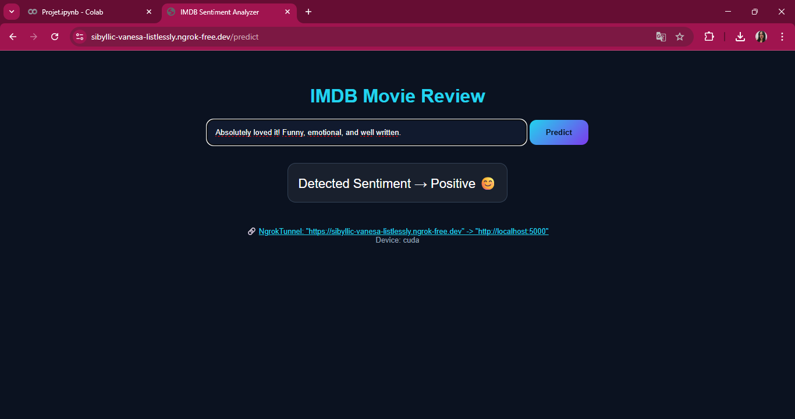

# 🎬 IMDB Movie Reviews – Sentiment Analysis (DistilBERT)

This project applies **fine-tuning of DistilBERT** on the **IMDB dataset (50,000 reviews)**
to perform **binary sentiment classification (positive / negative)**.
## 🖥️ Demo Interface



## 🧠 Model
- Transformer: distilbert-base-uncased
- Fine-tuned on IMDB dataset
- Task: Sentiment Analysis

## 📊 Dataset
- 50,000 movie reviews
- CSV format
- Labels: positive / negative
- Train/Test split: 80% / 20%

## 🚀 Features
- Fine-tuning with HuggingFace Trainer
- Evaluation: Accuracy, Precision, Recall, F1-score
- REST API using Flask
- Deployed using Ngrok (demo)

## ▶️ How to run
```bash
pip install -r requirements.txt
python app.py
